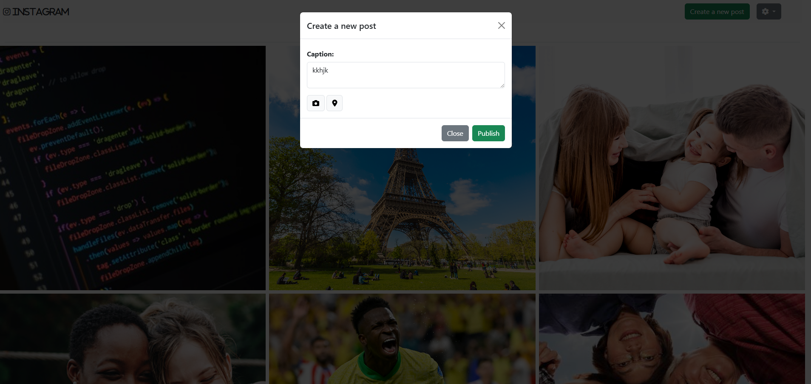
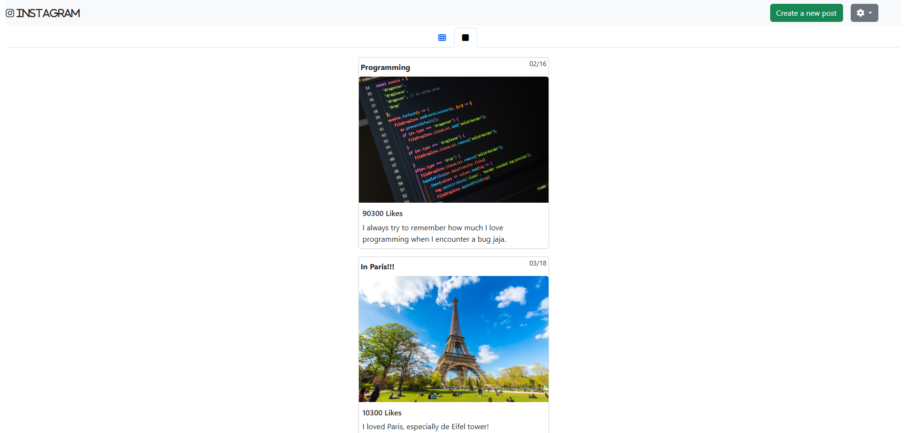

# Instagram Clone 📸  
**Share Moments, Connect with the World**

## 📖 Description  
This web application replicates key features of Instagram, allowing users to share their photos and captions in an engaging and dynamic environment. Users can easily switch between grid and list views for their posts, and create new posts through an elegant modal interface.

---

## ✨ Key Features  
- **Responsive Design**: Fully optimized for mobile, tablet, and desktop devices.  
- **Dynamic Post Management**:  
  - Users can create posts with captions and images.  
  - Posts are displayed in both grid and list views for better accessibility.  
- **Interactive Modal**:  
  - A clean, user-friendly modal for creating new posts, ensuring a smooth experience.  
- **Elegant UI**: A visually appealing design inspired by Instagram.  

---

## 🛠️ Technologies Used  

### **Frontend**  
- **HTML5**: Semantic structure for building the content.  
- **CSS3**: Custom styles for a modern and responsive design.  
- **Bootstrap**: Quick and effective styling for components and layout.  
- **JavaScript**: Adds interactivity 

---

## 📷 Screenshots  

### Create a New Post  

### Posts Display  

---

## 💡 Future Improvements  
- Add user authentication for personalized profiles.  
- Enable likes and comments on posts.  
- Enhance the grid view with animations for a smoother user experience.  
